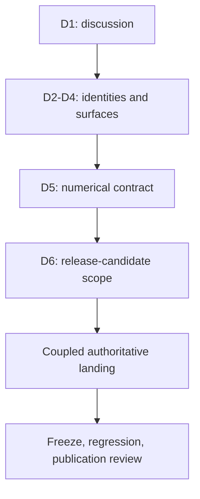

# Release 2 formal decision packet

Status: **DECISION-PREPARATION — unissued and not adopted**.

This packet assembles the exact questions, existing candidate inputs, review
receipts, and required future authoritative change set for the Release 2 paired-t
vertical slice. It is intended to make the post-discussion steward decision
reviewable without treating candidate work as Protocol meaning.

The governing public discussion is [RFC #25](https://github.com/licklider-ai/nomue-protocol/issues/25).
It opened at `2026-08-26T20:52:54Z`; its earliest decision time is
`2026-09-25T20:52:54Z`. Expiry of that window does not adopt Release 2.

This packet does not issue a Requirement ID or Protocol identifier, freeze a
numerical contract, register a schema, Check, reason code, or Bundle, enable paired-t
support, authorize an authoritative landing, or alter Release 1.

## Reading order

1. [Decision ledger](DECISION-LEDGER.md) — the steward decisions D1 through D6,
   their current state, and the evidence required for each disposition.
2. [Evidence and disposition index](EVIDENCE-AND-DISPOSITION.md) — bounded review
   receipts and the claims they do and do not establish.
3. [Authoritative landing outline](AUTHORITATIVE-LANDING-OUTLINE.md) — the single
   coupled change set that may be prepared only after the required decisions.
4. [Independent packet review commission](INDEPENDENT-PACKET-REVIEW.md) — the
   bounded review to perform against the exact packet head before asking for the
   steward decision.
5. [Independent packet review result](../../../review-inputs/r2-formal-decision-packet-20260918/REVIEW-RESULT.md)
   — the preserved `REPAIR_REQUIRED` review of the original packet head and the
   required close-only repair confirmation.

## Scope

The only proposed new capability is the RFC #25 paired two-condition continuous
vertical slice: a paired-t Contract, a paired two-condition Profile, successor
Record and verification-report surfaces, scoped admissibility/computability/
recomputation checks, and a successor interpretation Bundle. Signed-rank,
Mann-Whitney, standardized effects, approval or attestation expansion, and broader
runtime support remain excluded.

## Decision sequence

The packet preserves this order. It does not infer an affirmative disposition from
any earlier candidate review.
